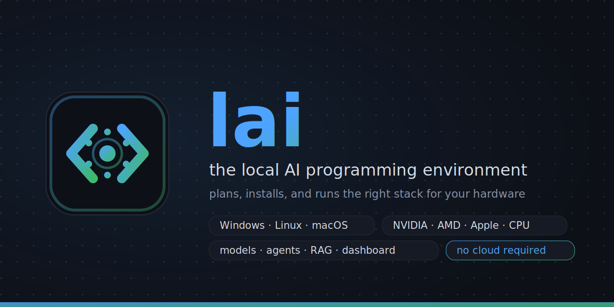

#  lai



**lai - the local AI programming environment that adapts to your hardware.**
(Named for what you type: `lai`. Not affiliated with the LocalAI inference server.)
One stdlib-only Python file orchestrates llama.cpp, a model router, coding agents,
repo RAG, and project scaffolding - on **Windows, Linux, and macOS**, across
**NVIDIA (CUDA), AMD (Vulkan/ROCm), Apple Silicon (Metal), and CPU-only** machines.

- Everything runs on your hardware. No cloud calls, no telemetry.
- All knowledge lives in an **editable table** ([config/catalog.json](config/catalog.json)):
  hardware tiers, models, use cases, project stacks. Change the table, re-plan, done.
- A planner detects your machine, proposes the best choices, and you **review, change,
  and re-change them at any time** - in a web dashboard or the terminal.
- Anything that installs or downloads **asks for your approval first** (`--yes` to skip).
- Projects scaffolded here carry their AI config **in the repo**, so they work on every
  teammate's machine - a gate command reconciles what can't travel (models on disk).

## The stack

| Layer | Choice | Why it won |
| --- | --- | --- |
| Inference | [llama.cpp](https://github.com/ggml-org/llama.cpp) `llama-server` | Only engine with MoE CPU-offload (30B-class coders on 6 GB GPUs), native on all 3 OSes/4 GPU vendors, OpenAI-compatible with tool calling |
| Model router | [llama-swap](https://github.com/mostlygeek/llama-swap) | One endpoint (`:8080/v1`); hot-swaps coder / thinker / vision on demand |
| Models | Qwen3-Coder MoE family + role specialists | Agent-trained, 256K context, polyglot; see the catalog for the full registry per hardware tier |
| IDE agents | Roo Code + Continue (+ Aider in the terminal) | Agentic modes / local tab-autocomplete / git-surgical edits |
| Autonomy | OpenHands (Docker) | Sandboxed edit-compile-test loops |
| Repo RAG | Qdrant + local embeddings | Roo Code indexes monorepos into it natively |
| Chat UI | Open WebUI | ChatGPT-style chat + document RAG on the same endpoint |

Architecture, trade-offs, and data flow: [docs/01-architecture.md](docs/01-architecture.md).

## IDE plugins

| Editor | Plugin | Role |
| --- | --- | --- |
| VS Code | **Roo Code** (`RooVeterinaryInc.roo-cline`) | the agent: modes, codebase RAG, MCP tools - configured per [docs/03](docs/03-agents-ide.md) |
| VS Code | **Continue** (`Continue.continue`) | tab-autocomplete + inline chat - `lai ide` installs the config |
| VS Code | **Local AI Env** ([editors/vscode](editors/vscode/)) | our thin companion: `lai` status-bar button, dashboard/start/stop/gate/AI-review/chat from the command palette |
| JetBrains / Neovim | Continue / `llm.nvim` + Aider in the terminal | same endpoint, second-class but workable |

The companion extension installs without any build tools - copy the folder into
`~/.vscode/extensions/` (see its [README](editors/vscode/README.md)).

## New here? Three steps

```text
1. install   (one line - see below)
2. lai go    (one friendly question, then it does everything)
3. double-click "Local AI Env" and start chatting
```

Full hand-holding version: [docs/easy-start.md](docs/easy-start.md). The
dashboard opens on a simple Home screen - status light, progress, and a chat
box; all the pro controls live in the other tabs.

## Quick start

One-line install (or just clone and run):

```text
Windows:    irm https://raw.githubusercontent.com/DevEpoch/lai/main/install.ps1 | iex
Linux/mac:  curl -fsSL https://raw.githubusercontent.com/DevEpoch/lai/main/install.sh | bash
```

Requires Python 3.9+. Commands are shown as `lai <cmd>`:
**Windows** `.\lai.ps1 <cmd>` ?? **Linux/macOS** `./lai.sh <cmd>` ?? anywhere `python lai.py <cmd>`.

```text
lai check       # hardware + prerequisites report (with per-OS install hints)
lai setup       # plan (pick your use case, review choices) -> engines -> models -> config -> IDE
lai docker      # Qdrant + OpenHands + Open WebUI (Docker must be running)
lai start       # start the inference stack + the dashboard (http://127.0.0.1:8090)
lai validate    # end-to-end smoke tests (chat, tool calls, autocomplete, RAG)
lai bench       # tokens/sec vs your tier's targets; --quality runs a task-solving suite
```

The dashboard (Vue 3 + TypeScript, in English / ????? / ??????? with full RTL)
starts with the stack at `http://127.0.0.1:8090` (also behind the **Local AI Env** desktop/app-menu shortcut
that the installer creates, or `lai shortcut` anytime):

```text
??? Choices ??? use case, model per role ??? ??? Projects ??? create / gate / +skill ???
??? Stack ??? start/stop, service lights ??? ??? Downloads ??? progress, pause/resume ???
??? Benchmarks ??? speed + quality runs  ??? ??? Maintenance + Logs ??? verify, tails ???
```

And the terminal gets a Claude-Code-style assistant on your local models:

```text
lai chat        # streaming REPL: @file attaches code, /model switches roles
```

## How choices work

1. `lai plan` detects platform, GPU vendor, VRAM, and RAM, and matches the first fitting
   **tier** in the catalog (14 tiers: Apple 8-64 GB+, GPU 3-48 GB+, CPU-only).
2. Your **use case** (general / web / mobile / systems / data-ml / scripts) overlays the
   tier: it enables or disables roles (e.g. the vision model for UI work) and tunes
   context - never beyond what your memory allows.
3. You review the proposal per role (coder / thinker / vision / autocomplete /
   embeddings) and accept or edit. Selections persist in `state/choices.json`.
4. Change anything later: `lai set coder devstral-small`, `lai set vision none`,
   or dropdowns in the UI - then apply and restart.

```text
lai catalog            # show the whole table; --verify checks every repo on Hugging Face
lai choices            # current selections + alternatives that fit this machine
lai set <role> <model> # switch one role (offers download + reconfigure)
```

Model downloads are **resumable by design** (pause, crash, reboot - they continue), and
`lai models` offers the `hf_transfer` accelerator for 3-10x multi-connection speed. The
UI shows progress bars with pause/resume.

## Projects: scaffold once, works on every machine

```text
lai new                                   # pick stack + path -> ready-to-code project
lai new --stack rust-cli --path ~/mytool
lai gate [path]                           # does THIS machine satisfy the project?
lai gate --fix                            # enable roles, offer downloads, reconfigure
```

`lai new` runs the **ecosystem's own generator** (`go mod init`, `cargo init`,
`npm create vite`, `flutter create`, ...) and layers the AI setup on top - all committed:
`AGENTS.md` (read automatically by Roo/Cline/Aider/OpenHands), `.vscode/` recommended
extensions, `.lai/project.json` (the **team contract**: required AI roles, min context,
toolchains), `docs/adr/`, git init. Personal preferences go in the untracked
`.lai/local.json`.

**Identity travels in the repo; capability lives on each machine; the gate reconciles
the two.** A teammate clones the project on any OS, runs `lai gate --fix`, approves the
downloads, and has the identical environment - no per-project settings to switch, ever.
Full team workflow: [docs/07-projects.md](docs/07-projects.md).

## Skills, research, and git AI

```text
lai skill list / add <name>    # 14 built-in skills: interview, review, research, tdd,
                               #   adr, memory, debug, security, docs-first, performance,
                               #   a11y, refactor, browser (Playwright MCP - agents verify
                               #   UIs in a real browser), security-scan (Semgrep MCP)
lai skill new <name> [--ai "description"]   # create your own - hand-written or drafted
                               #   by your local model; --project puts it IN the repo
lai git review [--base ref]    # AI code review of your diff, [BUG/RISK/TEST] file:line
lai git commit [--apply]       # conventional commit message from staged changes
lai git resolve                # AI merge-conflict resolution (verified, per-file approval)
lai git explain [ref]          # plain-language explanation of a commit or your changes
```

Web research is local too: `lai docker` runs **SearXNG** (self-hosted metasearch,
:8888); the `research` skill gives agents `web_search` + `fetch` tools via MCP, and
Open WebUI gets web-augmented answers. Roo Code's built-in **Enhance Prompt** is tuned
for local models with [config/roo-enhance-prompt.md](config/roo-enhance-prompt.md).
Details: [docs/08-skills-research-git.md](docs/08-skills-research-git.md).

## Team server, tuning, docs RAG

```text
lai share on / lai connect <host> --key K   # one GPU box serves the whole team;
                                            #   clients need no models, gates check the server
lai tune                # timed trials of runtime flags -> locks in the fastest
                        #   config for THIS machine (hybrid offload depth, KV, threads)
lai docs add <url|pdf>  # index project documentation into local per-project RAG
lai docs search "q"     # query it (agents call this via their command tool)
lai hftoken                # free Hugging Face token -> much faster model downloads
                           #   (huggingface.co/settings/tokens -> Read token; stored gitignored)
lai vscode                 # build + install the TypeScript VS Code companion extension
lai cloud add openrouter   # OPTIONAL cloud fallback (OpenRouter/OpenAI/Anthropic):
                           #   used only via or:/oa:/an: model prefixes - local stays default
lai info                # one-screen summary of the entire environment
lai doctor              # full diagnosis + support zip (logs + state, never secrets)
lai mirror              # speed-test HF mirrors; downloads rotate mirrors on retries
                        #   (downloads are byte-resumable through stalls, kills, reboots)
lai catalog --update    # pull the latest published recommendation table (diff + approval)
lai refresh             # discover NEW models on Hugging Face + catalog/self updates;
                        #   OS notification on findings; --schedule weekly automates it
lai update              # self-update over git (only changed files move, shows the
                        #   CHANGELOG delta first); --policy ask|auto|never; --to <version>
```

Details: [docs/09-team-tune-docsrag.md](docs/09-team-tune-docsrag.md).

## Day-2 operations

```text
lai apikey      # require a bearer token on all model endpoints (do this on shared networks)
lai autostart   # start + watchdog at login (Startup / systemd / launchd); --remove undoes
lai upgrade     # llama.cpp / llama-swap release check (monthly speedups are real)
lai bench --quality   # 12-task solving suite - compare models on evidence after catalog edits
lai status / logs/ / restart
```

Dense coders get **speculative decoding** automatically when fully on GPU (+30-60%).

## Ports

| Port | Service |
| --- | --- |
| 8080 | llama-swap - the OpenAI-compatible endpoint (`coder`, `thinker`, `vision`, `coder-longctx`) |
| 8081 / 8082 | autocomplete / embeddings (always on) |
| 8090 | `lai ui` dashboard (localhost only) |
| 6333 | Qdrant |
| 3000 / 3001 | OpenHands / Open WebUI |
| 8765 | OpenMemory MCP (optional profile) |
| 8888 | SearXNG (local web search for agents + Open WebUI) |

## Repository layout

```text
lai.py                 entry point (stdlib only)
laicore/               the implementation: core | stack | work | projects | webui | cli
lai.ps1 / lai.sh       thin OS wrappers
config/                versioned knowledge + templates
  catalog.json           THE TABLE: models, tiers, use cases, stacks (edit me)
  ui.html                the dashboard
  docker-compose.yml     Qdrant, OpenHands, Open WebUI, OpenMemory
  continue.config.yaml   IDE config installed by `lai ide`
  AGENTS.template.md / aider.conf.yml
skills/                reusable agent skills (interview, review, research, tdd, adr)
docs/                  documentation (see below)
state/                 machine-local: choices, secrets, generated configs  (gitignored)
tools/ models/ logs/ run/ benchmarks/   runtime artifacts                  (gitignored)
```

## Documentation

1. [Architecture & data flow](docs/01-architecture.md)
2. [Model stack & memory budgets](docs/02-models.md)
3. [Agents & IDE setup](docs/03-agents-ide.md)
4. [Hardware upgrade path (eGPU example)](docs/04-upgrade-egpu.md)
5. [Troubleshooting](docs/05-troubleshooting.md)
6. [Hardware catalog research & sources](docs/06-hardware-catalog.md)
7. [Projects & team workflow](docs/07-projects.md)
8. [Skills, web research, prompt enhancement, git AI](docs/08-skills-research-git.md)
9. [Team server, auto-tuning, docs RAG, updates](docs/09-team-tune-docsrag.md)
10. [Cloud fallback - optional, explicit, minimal](docs/10-cloud-fallback.md)
11. [LLM reference - complete machine-oriented surface](docs/llm-reference.md)
12. [Easy start - for absolute beginners](docs/easy-start.md)

## For LLMs and AI agents

This repo ships [llms.txt](llms.txt) (llmstxt.org convention) and
[docs/llm-reference.md](docs/llm-reference.md) - a complete, factual reference
of every command, file contract, and HTTP API, plus canonical workflows and a
"things tutorials get wrong" list. Point any model at those two files and it
can accurately explain lai, build tutorials, or integrate against the local
endpoint. The repo also has its own [AGENTS.md](AGENTS.md) for coding agents
working on lai itself.

## Contributing

Most contributions are catalog edits, not code - see [CONTRIBUTING.md](CONTRIBUTING.md).
`lai selftest` runs the Python suite (36 tests: planning kernel, parsers,
catalog integrity, dashboard API integration, repo hygiene); Vitest covers the
dashboard (i18n parity/RTL, api client) and the extension (9 tests each); CI runs
all suites on Windows, Linux, and
macOS, and pull requests get a free automated AI review via GitHub Models.
Every release documents its changes in [CHANGELOG.md](CHANGELOG.md) - that is
what `lai update` shows users before applying.

## License

[MIT](LICENSE)
